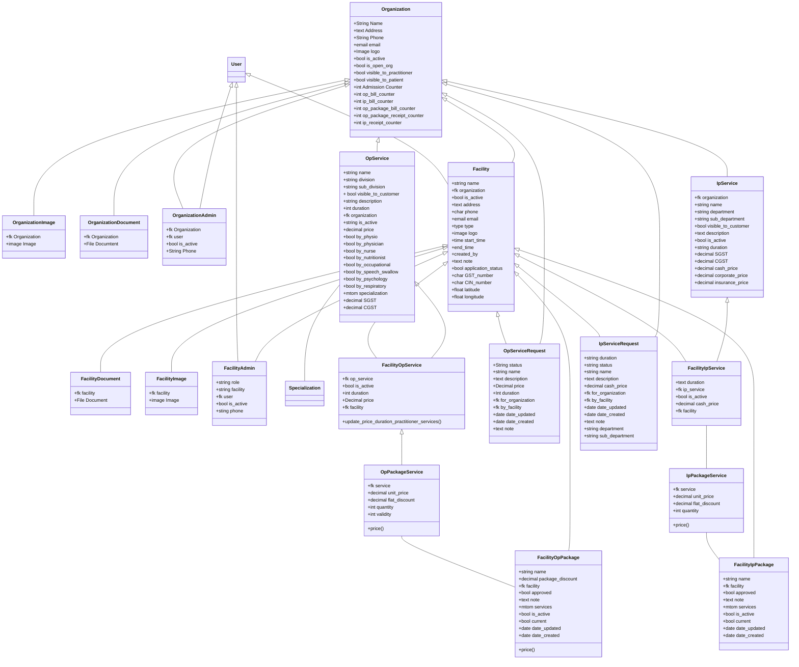

[![](https://mermaid.ink/img/eyJjb2RlIjoiY2xhc3NEaWFncmFtXG5Pcmdhbml6YXRpb24gPHwtLSBPcmdhbml6YXRpb25JbWFnZVxuT3JnYW5pemF0aW9uIDx8LS0gT3JnYW5pemF0aW9uRG9jdW1lbnRcblVzZXIgPHwtLSBPcmdhbml6YXRpb25BZG1pblxuT3JnYW5pemF0aW9uIDx8LS0gT3JnYW5pemF0aW9uQWRtaW5cbk9yZ2FuaXphdGlvbiA8fC0tIEZhY2lsaXR5XG5Vc2VyIDx8LS0gRmFjaWxpdHlcbkZhY2lsaXR5IDx8LS0gRmFjaWxpdHlEb2N1bWVudFxuRmFjaWxpdHkgPHwtLSBGYWNpbGl0eUltYWdlXG5GYWNpbGl0eSA8fC0tIEZhY2lsaXR5QWRtaW5cblVzZXIgPHwtLSBGYWNpbGl0eUFkbWluXG5Pcmdhbml6YXRpb24gPHwtLSBPcFNlcnZpY2Vcbk9wU2VydmljZSAtLSBTcGVjaWFsaXphdGlvblxuT3BTZXJ2aWNlIDx8LS0gRmFjaWxpdHlPcFNlcnZpY2VcbkZhY2lsaXR5IDx8LS0gRmFjaWxpdHlPcFNlcnZpY2Vcbk9yZ2FuaXphdGlvbiA8fC0tIE9wU2VydmljZVJlcXVlc3RcbkZhY2lsaXR5IDx8LS0gT3BTZXJ2aWNlUmVxdWVzdFxuT3JnYW5pemF0aW9uIDx8LS0gSXBTZXJ2aWNlXG5JcFNlcnZpY2UgPHwtLSBGYWNpbGl0eUlwU2VydmljZVxuRmFjaWxpdHkgPHwtLSBGYWNpbGl0eUlwU2VydmljZVxuT3JnYW5pemF0aW9uIDx8LS0gSXBTZXJ2aWNlUmVxdWVzdFxuRmFjaWxpdHkgPHwtLSBJcFNlcnZpY2VSZXF1ZXN0XG5GYWNpbGl0eU9wU2VydmljZSA8fC0tIE9wUGFja2FnZVNlcnZpY2VcbkZhY2lsaXR5IDx8LS0gRmFjaWxpdHlPcFBhY2thZ2Vcbk9wUGFja2FnZVNlcnZpY2UgLS0gRmFjaWxpdHlPcFBhY2thZ2VcbkZhY2lsaXR5SXBTZXJ2aWNlIC0tIElwUGFja2FnZVNlcnZpY2VcbkZhY2lsaXR5IDx8LS0gRmFjaWxpdHlJcFBhY2thZ2VcbklwUGFja2FnZVNlcnZpY2UgLS0gRmFjaWxpdHlJcFBhY2thZ2VcblxuICAgICAgXG5jbGFzcyBGYWNpbGl0eUlwUGFja2FnZSB7IFxuICAgIFxuICAgICtzdHJpbmcgbmFtZSBcbiAgICArZmsgZmFjaWxpdHkgXG4gICAgK2Jvb2wgYXBwcm92ZWQgXG4gICAgK3RleHQgbm90ZSBcbiAgICArbXRvbSBzZXJ2aWNlcyBcbiAgICArYm9vbCBpc19hY3RpdmVcbiAgICArYm9vbCBjdXJyZW50IFxuICAgICtkYXRlIGRhdGVfdXBkYXRlZCBcbiAgICArZGF0ZSBkYXRlX2NyZWF0ZWQgXG4gICAgXG4gICAgfVxuICAgIFxuY2xhc3MgT3BQYWNrYWdlU2VydmljZXtcbiAgICBcbiAgICArZmsgc2VydmljZSAgXG4gICAgK2RlY2ltYWwgdW5pdF9wcmljZSBcbiAgICArZGVjaW1hbCBmbGF0X2Rpc2NvdW50IFxuICAgICtpbnQgcXVhbnRpdHlcbiAgICAraW50IHZhbGlkaXR5IFxuICAgICtwcmljZSgpXG59XG5cblxuY2xhc3MgRmFjaWxpdHkgeyBcblxuICAgK3N0cmluZyBuYW1lIFxuICAgK2ZrIG9yZ2FuaXphdGlvbiBcbiAgICtib29sIGlzX2FjdGl2ZVxuICAgK3RleHQgYWRkcmVzc1xuICAgK2NoYXIgcGhvbmUgXG4gICArZW1haWwgZW1haWwgXG4gICArdHlwZSB0eXBlXG4gICAraW1hZ2UgbG9nbyBcbiAgICt0aW1lIHN0YXJ0X3RpbWUgXG4gICArZW5kX3RpbWUgXG4gICArY3JlYXRlZF9ieSBcbiAgICt0ZXh0IG5vdGUgXG4gICArYm9vbCBhcHBsaWNhdGlvbl9zdGF0dXMgXG4gICArY2hhciBHU1RfbnVtYmVyIFxuICAgK2NoYXIgQ0lOX251bWJlciBcbiAgICtmbG9hdCBsYXRpdHVkZVxuICAgK2Zsb2F0IGxvbmdpdHVkZVxuXG4gICAgfVxuICAgIFxuY2xhc3MgRmFjaWxpdHlPcFBhY2thZ2V7XG5cbiAgIFxuICAgICtzdHJpbmcgbmFtZSBcbiAgICArZGVjaW1hbCBwYWNrYWdlX2Rpc2NvdW50XG4gICAgK2ZrIGZhY2lsaXR5XG4gICAgK2Jvb2wgYXBwcm92ZWQgXG4gICAgK3RleHQgbm90ZVxuICAgICttdG9tIHNlcnZpY2VzIFxuICAgICtib29sIGlzX2FjdGl2ZSAgICBcbiAgICArYm9vbCBjdXJyZW50IFxuICAgICtkYXRlIGRhdGVfdXBkYXRlZCBcbiAgICArZGF0ZSBkYXRlX2NyZWF0ZWQgXG4gICAgK3ByaWNlKClcbiAgICBcbiAgICB9XG4gICAgXG4gIGNsYXNzIElwUGFja2FnZVNlcnZpY2UgeyBcbiAgXG4gICArZmsgc2VydmljZSBcbiAgICtkZWNpbWFsIHVuaXRfcHJpY2VcbiAgICtkZWNpbWFsIGZsYXRfZGlzY291bnQgXG4gICAraW50IHF1YW50aXR5XG4gICArcHJpY2UoKVxuXG4gIFxuICAgIH1cbiAgICBcbmNsYXNzIE9yZ2FuaXphdGlvbkltYWdle1xuXG5cdCtmayBPcmdhbml6YXRpb25cblx0K2ltYWdlIEltYWdlXG59XG5cbmNsYXNzIElwU2VydmljZVJlcXVlc3R7XG5cbiAgICArc3RyaW5nIGR1cmF0aW9uIFxuICAgICtzdHJpbmcgc3RhdHVzIFxuICAgICtzdHJpbmcgbmFtZSBcbiAgICArdGV4dCBkZXNjcmlwdGlvblxuICAgICtkZWNpbWFsIGNhc2hfcHJpY2UgXG4gICAgK2ZrIGZvcl9vcmdhbml6YXRpb24gXG4gICAgK2ZrIGJ5X2ZhY2lsaXR5IFxuICAgICtkYXRlIGRhdGVfdXBkYXRlZCBcbiAgICArZGF0ZSBkYXRlX2NyZWF0ZWQgXG4gICAgK3RleHQgbm90ZVxuICAgICtzdHJpbmcgZGVwYXJ0bWVudCBcbiAgICArc3RyaW5nIHN1Yl9kZXBhcnRtZW50IFxufVxuIFxuIFxuY2xhc3MgRmFjaWxpdHlJcFNlcnZpY2V7XG5cbiAgICArdGV4dCBkdXJhdGlvbiBcbiAgICArZmsgaXBfc2VydmljZSBcbiAgICArYm9vbCBpc19hY3RpdmUgXG4gICAgK2RlY2ltYWwgY2FzaF9wcmljZSBcbiAgICArZmsgZmFjaWxpdHkgXG4gICAgXG4gICAgfVxuXG5jbGFzcyBJcFNlcnZpY2Uge1xuXG4gICAgK2ZrIG9yZ2FuaXphdGlvbiBcbiAgICArc3RyaW5nIG5hbWUgXG4gICAgK3N0cmluZyBkZXBhcnRtZW50IFxuICAgICtzdHJpbmcgc3ViX2RlcGFydG1lbnQgXG4gICAgK2Jvb2wgdmlzaWJsZV90b19jdXN0b21lciBcbiAgICArdGV4dCBkZXNjcmlwdGlvbiBcbiAgICArYm9vbCBpc19hY3RpdmUgXG4gICAgK3N0cmluZyBkdXJhdGlvbiBcbiAgICArZGVjaW1hbCBTR1NUIFxuICAgICtkZWNpbWFsIENHU1QgXG4gICAgK2RlY2ltYWwgY2FzaF9wcmljZSBcbiAgICArZGVjaW1hbCBjb3Jwb3JhdGVfcHJpY2UgXG4gICAgK2RlY2ltYWwgaW5zdXJhbmNlX3ByaWNlIFxuICAgIFxuICAgIH1cblxuXG5jbGFzcyBPcFNlcnZpY2VSZXF1ZXN0e1xuXG4gICAgK1N0cmluZyBzdGF0dXMgXG4gICAgK3N0cmluZyBuYW1lIFxuICAgICt0ZXh0IGRlc2NyaXB0aW9uIFxuICAgICtEZWNpbWFsIHByaWNlIFxuICAgICtJbnQgZHVyYXRpb24gXG4gICAgK2ZrIGZvcl9vcmdhbml6YXRpb25cbiAgICArZmsgYnlfZmFjaWxpdHkgXG4gICAgK2RhdGUgZGF0ZV91cGRhdGVkIFxuICAgICtkYXRlIGRhdGVfY3JlYXRlZCBcbiAgICArdGV4dCBub3RlIFxufVxuXG5jbGFzcyBGYWNpbGl0eU9wU2VydmljZXtcblxuXHQrZmsgb3Bfc2VydmljZSBcbiAgICArYm9vbCBpc19hY3RpdmUgXG4gICAgK2ludCBkdXJhdGlvbiBcbiAgICArRGVjaW1hbCBwcmljZVxuICAgICtmayBmYWNpbGl0eSBcbiAgICBcbit1cGRhdGVfcHJpY2VfZHVyYXRpb25fcHJhY3RpdGlvbmVyX3NlcnZpY2VzKClcbn1cblxuY2xhc3MgRmFjaWxpdHlEb2N1bWVudHtcblxuK2ZrIGZhY2lsaXR5XG4rRmlsZSBEb2N1bWVudFxuIFxuXG59XG5cbmNsYXNzIEZhY2lsaXR5QWRtaW57XG5cbitzdHJpbmcgcm9sZVxuK3N0cmluZyBmYWNpbGl0eVxuK2ZrIHVzZXJcbitib29sIGlzX2FjdGl2ZVxuK3N0aW5nIHBob25lXG5cbn1cblxuXG5cblxuXG5jbGFzcyBGYWNpbGl0eUltYWdle1xuXG4rZmsgZmFjaWxpdHlcbitpbWFnZSBJbWFnZVxuXG59XG5cbmNsYXNzIE9yZ2FuaXphdGlvbkRvY3VtZW50e1xuXG4rZmsgT3JnYW5pemF0aW9uXG4rRmlsZSBEb2N1bXRlbnRcblxufVxuICAgIFxuICAgIFxuICAgIFxuY2xhc3MgT3JnYW5pemF0aW9ue1xuICAgICAgK1N0cmluZyBOYW1lXG4gICAgICArdGV4dCBBZGRyZXNzXG4gICAgICArU3RyaW5nIFBob25lXG4gICAgICArZW1haWwgZW1haWxcbiAgICAgICtJbWFnZSBsb2dvXG4gICAgICArYm9vbCBpc19hY3RpdmVcbiAgICAgICtib29sIGlzX29wZW5fb3JnXG4gICAgICArYm9vbCB2aXNpYmxlX3RvX3ByYWN0aXRpb25lclxuICAgICAgK2Jvb2wgdmlzaWJsZV90b19wYXRpZW50IFxuICAgICAgK2ludCBBZG1pc3Npb24gQ291bnRlclxuICAgICAgK2ludCBvcF9iaWxsX2NvdW50ZXJcbiAgICAgICtpbnQgaXBfYmlsbF9jb3VudGVyXG4gICAgICAraW50IG9wX3BhY2thZ2VfYmlsbF9jb3VudGVyXG4gICAgICAraW50IG9wX3BhY2thZ2VfcmVjZWlwdF9jb3VudGVyIFxuICAgICAgK2ludCBpcF9yZWNlaXB0X2NvdW50ZXJcblxuICAgIH1cbiAgICBcbmNsYXNzIE9yZ2FuaXphdGlvbkFkbWlue1xuXG4gICAgK2ZrIE9yZ2FuaXphdGlvblxuICAgICtmayB1c2VyXG4gICAgK2Jvb2wgaXNfYWN0aXZlXG4gICAgK1N0cmluZyBQaG9uZVxufVxuXG5cbmNsYXNzIE9wU2VydmljZXtcblxuICAgICtzdHJpbmcgbmFtZSBcbiAgICArc3RyaW5nIGRpdmlzaW9uIFxuICAgICtzdHJpbmcgc3ViX2RpdmlzaW9uIFxuICAgICsgYm9vbCB2aXNpYmxlX3RvX2N1c3RvbWVyIFxuICAgICtzdHJpbmcgZGVzY3JpcHRpb24gXG4gICAgK2ludCBkdXJhdGlvbiBcbiAgICArZmsgb3JnYW5pemF0aW9uIFxuICAgICtzdHJpbmcgaXNfYWN0aXZlXG4gICAgK2RlY2ltYWwgcHJpY2UgXG4gICAgK2Jvb2wgYnlfcGh5c2lvIFxuICAgICtib29sIGJ5X3BoeXNpY2lhblxuICAgICtib29sIGJ5X251cnNlXG4gICAgK2Jvb2wgYnlfbnV0cml0aW9uaXN0IFxuICAgICtib29sIGJ5X29jY3VwYXRpb25hbCBcbiAgICArYm9vbCBieV9zcGVlY2hfc3dhbGxvdyBcbiAgICArYm9vbCBieV9wc3ljaG9sb2d5IFxuICAgICtib29sIGJ5X3Jlc3BpcmF0b3J5XG4gICAgK210b20gc3BlY2lhbGl6YXRpb24gXG4gICAgK2RlY2ltYWwgU0dTVFxuICAgICtkZWNpbWFsIENHU1QgXG4gICAgICAgICAgICAgICAgICAgICAgICAgICAgICBcblxufSAgIFxuXG4iLCJtZXJtYWlkIjp7InRoZW1lIjoiZGVmYXVsdCJ9LCJ1cGRhdGVFZGl0b3IiOmZhbHNlLCJhdXRvU3luYyI6dHJ1ZSwidXBkYXRlRGlhZ3JhbSI6ZmFsc2V9)](https://mermaid-js.github.io/mermaid-live-editor/edit#eyJjb2RlIjoiY2xhc3NEaWFncmFtXG5Pcmdhbml6YXRpb24gPHwtLSBPcmdhbml6YXRpb25JbWFnZVxuT3JnYW5pemF0aW9uIDx8LS0gT3JnYW5pemF0aW9uRG9jdW1lbnRcblVzZXIgPHwtLSBPcmdhbml6YXRpb25BZG1pblxuT3JnYW5pemF0aW9uIDx8LS0gT3JnYW5pemF0aW9uQWRtaW5cbk9yZ2FuaXphdGlvbiA8fC0tIEZhY2lsaXR5XG5Vc2VyIDx8LS0gRmFjaWxpdHlcbkZhY2lsaXR5IDx8LS0gRmFjaWxpdHlEb2N1bWVudFxuRmFjaWxpdHkgPHwtLSBGYWNpbGl0eUltYWdlXG5GYWNpbGl0eSA8fC0tIEZhY2lsaXR5QWRtaW5cblVzZXIgPHwtLSBGYWNpbGl0eUFkbWluXG5Pcmdhbml6YXRpb24gPHwtLSBPcFNlcnZpY2Vcbk9wU2VydmljZSAtLSBTcGVjaWFsaXphdGlvblxuT3BTZXJ2aWNlIDx8LS0gRmFjaWxpdHlPcFNlcnZpY2VcbkZhY2lsaXR5IDx8LS0gRmFjaWxpdHlPcFNlcnZpY2Vcbk9yZ2FuaXphdGlvbiA8fC0tIE9wU2VydmljZVJlcXVlc3RcbkZhY2lsaXR5IDx8LS0gT3BTZXJ2aWNlUmVxdWVzdFxuT3JnYW5pemF0aW9uIDx8LS0gSXBTZXJ2aWNlXG5JcFNlcnZpY2UgPHwtLSBGYWNpbGl0eUlwU2VydmljZVxuRmFjaWxpdHkgPHwtLSBGYWNpbGl0eUlwU2VydmljZVxuT3JnYW5pemF0aW9uIDx8LS0gSXBTZXJ2aWNlUmVxdWVzdFxuRmFjaWxpdHkgPHwtLSBJcFNlcnZpY2VSZXF1ZXN0XG5GYWNpbGl0eU9wU2VydmljZSA8fC0tIE9wUGFja2FnZVNlcnZpY2VcbkZhY2lsaXR5IDx8LS0gRmFjaWxpdHlPcFBhY2thZ2Vcbk9wUGFja2FnZVNlcnZpY2UgLS0gRmFjaWxpdHlPcFBhY2thZ2VcbkZhY2lsaXR5SXBTZXJ2aWNlIC0tIElwUGFja2FnZVNlcnZpY2VcbkZhY2lsaXR5IDx8LS0gRmFjaWxpdHlJcFBhY2thZ2VcbklwUGFja2FnZVNlcnZpY2UgLS0gRmFjaWxpdHlJcFBhY2thZ2VcblxuICAgICAgXG5jbGFzcyBGYWNpbGl0eUlwUGFja2FnZSB7IFxuICAgIFxuICAgICtzdHJpbmcgbmFtZSBcbiAgICArZmsgZmFjaWxpdHkgXG4gICAgK2Jvb2wgYXBwcm92ZWQgXG4gICAgK3RleHQgbm90ZSBcbiAgICArbXRvbSBzZXJ2aWNlcyBcbiAgICArYm9vbCBpc19hY3RpdmVcbiAgICArYm9vbCBjdXJyZW50IFxuICAgICtkYXRlIGRhdGVfdXBkYXRlZCBcbiAgICArZGF0ZSBkYXRlX2NyZWF0ZWQgXG4gICAgXG4gICAgfVxuICAgIFxuY2xhc3MgT3BQYWNrYWdlU2VydmljZXtcbiAgICBcbiAgICArZmsgc2VydmljZSAgXG4gICAgK2RlY2ltYWwgdW5pdF9wcmljZSBcbiAgICArZGVjaW1hbCBmbGF0X2Rpc2NvdW50IFxuICAgICtpbnQgcXVhbnRpdHlcbiAgICAraW50IHZhbGlkaXR5IFxuICAgICtwcmljZSgpXG59XG5cblxuY2xhc3MgRmFjaWxpdHkgeyBcblxuICAgK3N0cmluZyBuYW1lIFxuICAgK2ZrIG9yZ2FuaXphdGlvbiBcbiAgICtib29sIGlzX2FjdGl2ZVxuICAgK3RleHQgYWRkcmVzc1xuICAgK2NoYXIgcGhvbmUgXG4gICArZW1haWwgZW1haWwgXG4gICArdHlwZSB0eXBlXG4gICAraW1hZ2UgbG9nbyBcbiAgICt0aW1lIHN0YXJ0X3RpbWUgXG4gICArZW5kX3RpbWUgXG4gICArY3JlYXRlZF9ieSBcbiAgICt0ZXh0IG5vdGUgXG4gICArYm9vbCBhcHBsaWNhdGlvbl9zdGF0dXMgXG4gICArY2hhciBHU1RfbnVtYmVyIFxuICAgK2NoYXIgQ0lOX251bWJlciBcbiAgICtmbG9hdCBsYXRpdHVkZVxuICAgK2Zsb2F0IGxvbmdpdHVkZVxuXG4gICAgfVxuICAgIFxuY2xhc3MgRmFjaWxpdHlPcFBhY2thZ2V7XG5cbiAgIFxuICAgICtzdHJpbmcgbmFtZSBcbiAgICArZGVjaW1hbCBwYWNrYWdlX2Rpc2NvdW50XG4gICAgK2ZrIGZhY2lsaXR5XG4gICAgK2Jvb2wgYXBwcm92ZWQgXG4gICAgK3RleHQgbm90ZVxuICAgICttdG9tIHNlcnZpY2VzIFxuICAgICtib29sIGlzX2FjdGl2ZSAgICBcbiAgICArYm9vbCBjdXJyZW50IFxuICAgICtkYXRlIGRhdGVfdXBkYXRlZCBcbiAgICArZGF0ZSBkYXRlX2NyZWF0ZWQgXG4gICAgK3ByaWNlKClcbiAgICBcbiAgICB9XG4gICAgXG4gIGNsYXNzIElwUGFja2FnZVNlcnZpY2UgeyBcbiAgXG4gICArZmsgc2VydmljZSBcbiAgICtkZWNpbWFsIHVuaXRfcHJpY2VcbiAgICtkZWNpbWFsIGZsYXRfZGlzY291bnQgXG4gICAraW50IHF1YW50aXR5XG4gICArcHJpY2UoKVxuXG4gIFxuICAgIH1cbiAgICBcbmNsYXNzIE9yZ2FuaXphdGlvbkltYWdle1xuXG5cdCtmayBPcmdhbml6YXRpb25cblx0K2ltYWdlIEltYWdlXG59XG5cbmNsYXNzIElwU2VydmljZVJlcXVlc3R7XG5cbiAgICArc3RyaW5nIGR1cmF0aW9uIFxuICAgICtzdHJpbmcgc3RhdHVzIFxuICAgICtzdHJpbmcgbmFtZSBcbiAgICArdGV4dCBkZXNjcmlwdGlvblxuICAgICtkZWNpbWFsIGNhc2hfcHJpY2UgXG4gICAgK2ZrIGZvcl9vcmdhbml6YXRpb24gXG4gICAgK2ZrIGJ5X2ZhY2lsaXR5IFxuICAgICtkYXRlIGRhdGVfdXBkYXRlZCBcbiAgICArZGF0ZSBkYXRlX2NyZWF0ZWQgXG4gICAgK3RleHQgbm90ZVxuICAgICtzdHJpbmcgZGVwYXJ0bWVudCBcbiAgICArc3RyaW5nIHN1Yl9kZXBhcnRtZW50IFxufVxuIFxuIFxuY2xhc3MgRmFjaWxpdHlJcFNlcnZpY2V7XG5cbiAgICArdGV4dCBkdXJhdGlvbiBcbiAgICArZmsgaXBfc2VydmljZSBcbiAgICArYm9vbCBpc19hY3RpdmUgXG4gICAgK2RlY2ltYWwgY2FzaF9wcmljZSBcbiAgICArZmsgZmFjaWxpdHkgXG4gICAgXG4gICAgfVxuXG5jbGFzcyBJcFNlcnZpY2Uge1xuXG4gICAgK2ZrIG9yZ2FuaXphdGlvbiBcbiAgICArc3RyaW5nIG5hbWUgXG4gICAgK3N0cmluZyBkZXBhcnRtZW50IFxuICAgICtzdHJpbmcgc3ViX2RlcGFydG1lbnQgXG4gICAgK2Jvb2wgdmlzaWJsZV90b19jdXN0b21lciBcbiAgICArdGV4dCBkZXNjcmlwdGlvbiBcbiAgICArYm9vbCBpc19hY3RpdmUgXG4gICAgK3N0cmluZyBkdXJhdGlvbiBcbiAgICArZGVjaW1hbCBTR1NUIFxuICAgICtkZWNpbWFsIENHU1QgXG4gICAgK2RlY2ltYWwgY2FzaF9wcmljZSBcbiAgICArZGVjaW1hbCBjb3Jwb3JhdGVfcHJpY2UgXG4gICAgK2RlY2ltYWwgaW5zdXJhbmNlX3ByaWNlIFxuICAgIFxuICAgIH1cblxuXG5jbGFzcyBPcFNlcnZpY2VSZXF1ZXN0e1xuXG4gICAgK1N0cmluZyBzdGF0dXMgXG4gICAgK3N0cmluZyBuYW1lIFxuICAgICt0ZXh0IGRlc2NyaXB0aW9uIFxuICAgICtEZWNpbWFsIHByaWNlIFxuICAgICtJbnQgZHVyYXRpb24gXG4gICAgK2ZrIGZvcl9vcmdhbml6YXRpb25cbiAgICArZmsgYnlfZmFjaWxpdHkgXG4gICAgK2RhdGUgZGF0ZV91cGRhdGVkIFxuICAgICtkYXRlIGRhdGVfY3JlYXRlZCBcbiAgICArdGV4dCBub3RlIFxufVxuXG5jbGFzcyBGYWNpbGl0eU9wU2VydmljZXtcblxuXHQrZmsgb3Bfc2VydmljZSBcbiAgICArYm9vbCBpc19hY3RpdmUgXG4gICAgK2ludCBkdXJhdGlvbiBcbiAgICArRGVjaW1hbCBwcmljZVxuICAgICtmayBmYWNpbGl0eSBcbiAgICBcbit1cGRhdGVfcHJpY2VfZHVyYXRpb25fcHJhY3RpdGlvbmVyX3NlcnZpY2VzKClcbn1cblxuY2xhc3MgRmFjaWxpdHlEb2N1bWVudHtcblxuK2ZrIGZhY2lsaXR5XG4rRmlsZSBEb2N1bWVudFxuIFxuXG59XG5cbmNsYXNzIEZhY2lsaXR5QWRtaW57XG5cbitzdHJpbmcgcm9sZVxuK3N0cmluZyBmYWNpbGl0eVxuK2ZrIHVzZXJcbitib29sIGlzX2FjdGl2ZVxuK3N0aW5nIHBob25lXG5cbn1cblxuXG5cblxuXG5jbGFzcyBGYWNpbGl0eUltYWdle1xuXG4rZmsgZmFjaWxpdHlcbitpbWFnZSBJbWFnZVxuXG59XG5cbmNsYXNzIE9yZ2FuaXphdGlvbkRvY3VtZW50e1xuXG4rZmsgT3JnYW5pemF0aW9uXG4rRmlsZSBEb2N1bXRlbnRcblxufVxuICAgIFxuICAgIFxuICAgIFxuY2xhc3MgT3JnYW5pemF0aW9ue1xuICAgICAgK1N0cmluZyBOYW1lXG4gICAgICArdGV4dCBBZGRyZXNzXG4gICAgICArU3RyaW5nIFBob25lXG4gICAgICArZW1haWwgZW1haWxcbiAgICAgICtJbWFnZSBsb2dvXG4gICAgICArYm9vbCBpc19hY3RpdmVcbiAgICAgICtib29sIGlzX29wZW5fb3JnXG4gICAgICArYm9vbCB2aXNpYmxlX3RvX3ByYWN0aXRpb25lclxuICAgICAgK2Jvb2wgdmlzaWJsZV90b19wYXRpZW50IFxuICAgICAgK2ludCBBZG1pc3Npb24gQ291bnRlclxuICAgICAgK2ludCBvcF9iaWxsX2NvdW50ZXJcbiAgICAgICtpbnQgaXBfYmlsbF9jb3VudGVyXG4gICAgICAraW50IG9wX3BhY2thZ2VfYmlsbF9jb3VudGVyXG4gICAgICAraW50IG9wX3BhY2thZ2VfcmVjZWlwdF9jb3VudGVyIFxuICAgICAgK2ludCBpcF9yZWNlaXB0X2NvdW50ZXJcblxuICAgIH1cbiAgICBcbmNsYXNzIE9yZ2FuaXphdGlvbkFkbWlue1xuXG4gICAgK2ZrIE9yZ2FuaXphdGlvblxuICAgICtmayB1c2VyXG4gICAgK2Jvb2wgaXNfYWN0aXZlXG4gICAgK1N0cmluZyBQaG9uZVxufVxuXG5cbmNsYXNzIE9wU2VydmljZXtcblxuICAgICtzdHJpbmcgbmFtZSBcbiAgICArc3RyaW5nIGRpdmlzaW9uIFxuICAgICtzdHJpbmcgc3ViX2RpdmlzaW9uIFxuICAgICsgYm9vbCB2aXNpYmxlX3RvX2N1c3RvbWVyIFxuICAgICtzdHJpbmcgZGVzY3JpcHRpb24gXG4gICAgK2ludCBkdXJhdGlvbiBcbiAgICArZmsgb3JnYW5pemF0aW9uIFxuICAgICtzdHJpbmcgaXNfYWN0aXZlXG4gICAgK2RlY2ltYWwgcHJpY2UgXG4gICAgK2Jvb2wgYnlfcGh5c2lvIFxuICAgICtib29sIGJ5X3BoeXNpY2lhblxuICAgICtib29sIGJ5X251cnNlXG4gICAgK2Jvb2wgYnlfbnV0cml0aW9uaXN0IFxuICAgICtib29sIGJ5X29jY3VwYXRpb25hbCBcbiAgICArYm9vbCBieV9zcGVlY2hfc3dhbGxvdyBcbiAgICArYm9vbCBieV9wc3ljaG9sb2d5IFxuICAgICtib29sIGJ5X3Jlc3BpcmF0b3J5XG4gICAgK210b20gc3BlY2lhbGl6YXRpb24gXG4gICAgK2RlY2ltYWwgU0dTVFxuICAgICtkZWNpbWFsIENHU1QgXG4gICAgICAgICAgICAgICAgICAgICAgICAgICAgICBcblxufSAgIFxuXG4iLCJtZXJtYWlkIjoie1xuICBcInRoZW1lXCI6IFwiZGVmYXVsdFwiXG59IiwidXBkYXRlRWRpdG9yIjpmYWxzZSwiYXV0b1N5bmMiOnRydWUsInVwZGF0ZURpYWdyYW0iOmZhbHNlfQ)

#Inpatient

[![](https://mermaid.ink/img/eyJjb2RlIjoiY2xhc3NEaWFncmFtXG5cbkZhY2lsaXR5IDwtLSBGYWNpbGl0eUJlZFxuRmFjaWxpdHkgPC0tIEFkbWlzc2lvblxuRmFjaWxpdHkgPC0tIE1lZGljYXRpb25cbkZhY2lsaXR5IDwtLSBNZW51SXRlbVxuRmFjaWxpdHkgPC0tIE1lbnVJdGVtQnlUeXBlXG5QYXRpZW50IDwtLSBBZG1pc3Npb25cbkZhY2lsaXR5QWRtaW4gPC0tIEFkbWlzc2lvblxuQWRtaXNzaW9uIDwtLSAgQWRtaXNzaW9uQ2FjaGVcbmFkbWlzc2lvbiA8LS0gQWRtaXNzaW9uUGFja2FnZVxuQWRtaXNzaW9uIDwtLSBBZG1pc3Npb25CZWRcbkFkbWlzc2lvbiA8LS0gQWRtaXNzaW9uUGF5bWVudFxuQWRtaXNzaW9uIDwtLSBBZG1pc3Npb25TZXJ2aWNlXG5BZG1pc3Npb24gPC0tIElQRU1SUmVjb3JkXG5BZG1pc3Npb24gPC0tIEludmVzdGlnYXRpb25cbkFkbWlzc2lvbiA8LS0gIFZpdGFsc1xuQWRtaXNzaW9uIDwtLSAgU2hpZnRIYW5kT3Zlck5vdGVcbkFkbWlzc2lvbiA8LS0gU2NhbGVEYXRhXG5BZG1pc3Npb24gPC0tIENvbnNlbnRGb3JtXG5BZG1pc3Npb24gPC0tIENhcmVJdGVtUmVxdWVzdFxuQWRtaXNzaW9uIDwtLSBDb25zZW50Rm9ybUZpbGVcbkFkbWlzc2lvbiA8LS0gQ2FyZUl0ZW1cbkZhY2lsaXR5SXBQYWNrYWdlIDwtLSBBZG1pc3Npb25QYWNrYWdlXG5GYWNpbGl0eUJlZCA8LS0gQWRtaXNzaW9uQmVkXG5QcmFjdGl0aW9uZXIgPC0tIEFkbWlzc2lvblNlcnZpY2VcbkZhY2lsaXR5SXBTZXJ2aWNlIDwtLSBBZG1pc3Npb25TZXJ2aWNlXG5BZG1pc3Npb24gPC0tICBQcm9ncmVzc05vdGVcblByYWN0aXRpb25lciAgPC0tICBQcm9ncmVzc05vdGVcblByYWN0aXRpb25lciA8LS0gTWVkaWNhdGlvblxuUHJhY3RpdGlvbmVyIDwtLSBNZW51SXRlbUJ5VHlwZVxuUHJhY3RpdGlvbmVyIDwtLSBJUEVNUlJlY29yZFxuUHJhY3RpdGlvbmVyIDwtLSBJbnZlc3RpZ2F0aW9uXG5QcmFjdGl0aW9uZXIgIDwtLSAgVml0YWxzXG5QcmFjdGl0aW9uZXIgPC0tICBTaGlmdEhhbmRPdmVyTm90ZVxuUHJhY3RpdGlvbmVyIDwtLSBDYXJlSXRlbVxuUHJhY3RpdGlvbmVyIDwtLSBDYXJlSXRlbVJlcXVlc3RcblByYWN0aXRpb25lciA8LS0gTWVudUl0ZW1cbkludmVzdGlnYXRpb24gPC0tIEludmVzdGlnYXRpb25SZXBvcnRcbklQRU1SUmVjb3JkIDwtLSBTY2FsZURhdGFcblVzZXIgPC0tIENvbnNlbnRGb3JtXG5Vc2VyIDwtLSBDb25zZW50Rm9ybUZpbGVcblVzZXIgPC0tIEFkbWlzc2lvblBheW1lbnRcblVzZXIgPC0tIEFkbWlzc2lvblNlcnZpY2VcblVzZXIgPC0tIEFkbWlzc2lvblNlcnZpY2VcblxuY2xhc3MgRmFjaWxpdHlCZWQgeyBcbiAgICBcbiAgICArZmsgZmFjaWxpdHlcbiAgICArc3RyaW5nIGJ1aWxkaW5nX25hbWUgXG4gICAgK3N0cmluZyBmbG9vcl9uYW1lIFxuICAgICtzdHJpbmcgcm9vbV90eXBlIFxuICAgICtzdHJpbmcgcm9vbV9uYW1lIFxuICAgICtzdHJpbmcgYmVkX25hbWUgXG4gICAgK2RlY2ltYWwgYmVkX3ByaWNlIFxuICAgICtib29sIGlzX2FjdGl2ZSBcbiAgICArYm9vbCBiZWRfaXNfb2NjdXBpZWRcbiAgICArZGVjaW1hbCBTR1NUIFxuICAgICtkZWNpbWFsIENHU1QgXG4gICAgK2RhdGUgZGF0ZV91cGRhdGVkIFxuICAgICtkYXRlIGRhdGVfY3JlYXRlZFxuXG4gICAgfVxuXG5cbmNsYXNzIEFkbWlzc2lvbiB7IFxuICAgIFxuICAgICtmayBwYXRpZW50IFxuICAgICtmayBmYWNpbGl0eSBcbiAgICAraW50IGFnZSBcbiAgICArc3RyaW5nIGJsb29kX2dyb3VwIFxuICAgICtzdHJpbmcgbWFyaXRhbF9zdGF0dXNcbiAgICArc3RyaW5nIG5hdGlvbmFsaXR5IFxuICAgICtzdHJpbmcgb2NjdXBhdGlvblxuICAgICtzdHJpbmcgZ292dF9pZF9ubyBcbiAgICArc3RyaW5nIHBlcm1hbmVudF9hZGRyZXNzIFxuICAgICtzdHJpbmcgZW1lcmdlbmN5X2NvbnRhY3RfbmFtZVxuICAgICtzdHJpbmcgZW1lcmdlbmN5X2NvbnRhY3Rfbm9cbiAgICArc3RyaW5nIHByaW1hcnlfcGFydG5lcl9uYW1lXG4gICAgK3N0cmluZyBwYXJ0bmVyX2NvbnRhY3Rfbm8gXG4gICAgK3N0cmluZyBjb25zdWx0YW50X25hbWVcbiAgICArc3RyaW5nIGRlc2lnbmF0aW9uXG4gICAgK3N0cmluZyBwYXllciBcbiAgICArc3RyaW5nIGluc3VyYW5jZV9jb3Jwb3JhdGVfbmFtZSBcbiAgICArc3RyaW5nIGluc3VyYW5jZV9jb3Jwb3JhdGVfaWQgXG4gICAgK3RleHQgbWVzc2FnZVxuICAgICtkYXRlIGRhdGVfdXBkYXRlZCBcbiAgICArZGF0ZSBkYXRlX2NyZWF0ZWRcbiAgICArZGF0ZSBzdGFydCAgXG4gICAgK2RhdGUgZW5kICxcbiAgICArYm9vbCBjb21wbGV0ZWQgIFxuICAgICtzdHJpbmcgZGlzY2hhcmdlX3N0YXR1c1xuICAgICtkZWNpbWFsIGZpbmFsX2Rpc2NvdW50XG4gICAgK3RleHQgZmluYWxfYmlsbCBcbiAgICArZmsgY29tcGxldGVkX3N0YXR1c19ieVxuICAgICtpbnQgb3JnYW5pemF0aW9uX2FkbWlzc2lvbl9ubyBcbiAgICAraW50IGJpbGxfbm8gXG4gICAgK2pzb24gZGFpbHlfbmVlZHMgXG4gICAgK2NoYXIgcHJpbWFyeV9ob3NwaXRhbF9uYW1lIFxuICAgICt0ZXh0IHByaW1hcnlfaG9zcGl0YWxfYWRkcmVzcyBcbiAgICAranNvbiBhZGRpdGlvbmFsX2luZm8gXG4gICAgK2dldF9wYXltZW50cygpXG4gICAgK2JlZF9saXN0KClcbiAgICArZ2V0X2JlZHMoKVxuICAgICtjdXJyZW50X2JlZCgpXG4gICAgK2FkZF9iZWQoKVxuICAgICt1cGRhdGVfYmVkKClcbiAgICArY2xvc2VfYmVkKClcbiAgICArZ2V0X2RheV93aXNlX2JpbGxcbiAgICArY2FjaGVkX2RheV93aXNlX2JpbGwoKVxuICAgICt1cGRhdGVfY2FjaGUoKVxuICAgICthZGRfb3JnYW5pemF0aW9uX2FkbWlzc2lvbl9ubygpXG5cbn1cbiAgIFxuXG5cbmNsYXNzIEFkbWlzc2lvbkNhY2hlIHtcblxuICAgICtvbmV0b29uZSBhZG1pc3Npb24gXG4gICAgK2pzb24gZGF5X3dpc2VfYmlsbCBcbiAgICArZGF0ZSBkYXRlX3VwZGF0ZWQgXG4gICAgK2RhdGUgZGF0ZV9jcmVhdGVkIFxuICAgIFxuICAgIH1cblxuICAgIFxuXG5jbGFzcyBBZG1pc3Npb25QYWNrYWdlIHtcbiBcbiBcbiAgICArc3RyaW5nIG5hbWUgXG4gICAgK2ZrIGFkbWlzc2lvbiBcbiAgICArZmsgaXBfcGFja2FnZSBcbiAgICAranNvbiBzZXJ2aWNlcyBcbiAgICArZGVjaW1hbCBwcmljZV9hZnRlcl9kaXNjb3VudCBcbiAgICArZGVjaW1hbCBkaXNjb3VudCBcbiAgICArZGF0ZSBkYXRlX3VwZGF0ZWQgXG4gICAgK2RhdGUgZGF0ZV9jcmVhdGVkXG4gICAgK2RhdGUgc3RhcnQgXG4gICAgK2RhdGUgZW5kIFxuICAgIFxuICAgIH1cblxuICAgIFxuXG5jbGFzcyBBZG1pc3Npb25CZWQge1xuXG5cbiAgICArZmsgYWRtaXNzaW9uIFxuICAgICtmayBiZWQgXG4gICAgK2RhdGUgZGF0ZV91cGRhdGVkIFxuICAgICtkYXRlIGRhdGVfY3JlYXRlZCBcbiAgICArZGF0ZSBzdGFydFxuICAgICtkYXRlIGVuZFxuICAgICtkZWNpbWFsIGJlZF9wcmljZSBcbiAgICArYm9vbCBjdXJyZW50IFxuXG4gICB9XG4gICBcbmNsYXNzIEFkbWlzc2lvblBheW1lbnR7XG5cbiAgICArZmsgYWRtaXNzaW9uIFxuICAgICtzdHJpbmcgcGF5ZXIgXG4gICAgK2ludCBwYXltZW50X21vZGUgXG4gICAgK2ZrIGNyZWF0ZWRfYnkgXG4gICAgK2ZrIHZlcmlmaWVkX2J5IFxuICAgICtkYXRlIGRhdGVfdXBkYXRlZCBcbiAgICArZGF0ZSBkYXRlX2NyZWF0ZWQgXG4gICAgK2ludCBzdGF0dXMgXG4gICAgK2RlY2ltYWwgYW1vdW50IFxuICAgICt0ZXh0IG5vdGUgXG4gICAgK2ludCByZWNlaXB0X25vIFxuXG5cdH1cblx0XG5jbGFzcyBBZG1pc3Npb25TZXJ2aWNlIHtcblxuICAgIFxuICAgICtmayBhZG1pc3Npb24gXG4gICAgK2ZrIHJlcXVlc3RlZF9ieSBcbiAgICArZmsgcGVyZm9ybWVkX2J5IFxuICAgICtmayB1cGRhdGVkX2J5IFxuICAgICtkYXRlIHVwZGF0ZWRfYXQgXG4gICAgK2RhdGUgY3JlYXRlZF9hdCBcbiAgICArZGF0ZSBwZXJmb3JtZWRfYXRcbiAgICArZGF0ZSB0b19iZV9wZXJmb3JtZWRfYXRcbiAgICArZmsgaXBfc2VydmljZSBcbiAgICArZGVjaW1hbCBjYXNoX3ByaWNlIFxuICAgICtib29sIGRvbmUgXG4gICAgK3N0cmluZyBub3RlXG4gICAgK3N0cmluZyBpbmZvIFxuICAgIH1cblxuXG5jbGFzcyBQcm9ncmVzc05vdGUge1xuXG5cbiAgICArZmsgYWRtaXNzaW9uIFxuICAgICtkYXRlIGNyZWF0ZWRfYXQgXG4gICAgK3RleHQgbm90ZSBcbiAgICArZmsgY3JlYXRlZF9ieSBcbiAgICArc3RyaW5nIHR5cGUgXG4gICAgK2NoYXIgc2lnbmF0dXJlIFxuICAgIFxuICAgIH1cblxuY2xhc3MgTWVkaWNhdGlvbiB7XG5cbiAgICArc3RyaW5nIG5hbWUgXG4gICAgK2ZrIGNyZWF0ZWRfYnkgXG4gICAgK2ZrIGZhY2lsaXR5IFxuICAgICtib29sIGFjY2VwdGVkIFxuICAgICtkYXRlIGRhdGVfdXBkYXRlZCBcbiAgICArZGF0ZSBkYXRlX2NyZWF0ZWQgXG5cbiAgIH1cbiAgIFxuY2xhc3MgTWVudUl0ZW1CeVR5cGUge1xuXG4gICAgK3N0cmluZyBuYW1lIFxuICAgICtmayBjcmVhdGVkX2J5IFxuICAgICtmayBmYWNpbGl0eSBcbiAgICArc3RyaW5nIHR5cGUgXG4gICAgK2pzb24gZGF0YSBcbiAgICArYm9vbCBhY2NlcHRlZCBcbiAgICArZGF0ZSBkYXRlX3VwZGF0ZWQgXG4gICAgK2RhdGUgZGF0ZV9jcmVhdGVkIFxuXG4gICAgICAgIH1cblxuY2xhc3MgSVBFTVJSZWNvcmQge1xuXG5cbiAgICArc3RyaW5nIG5hbWVcbiAgICArZmsgY3JlYXRlZF9ieSBcbiAgICArZmsgYWRtaXNzaW9uIFxuICAgICtqc29uIGRhdGEgXG4gICAgK2RhdGUgZGF0ZSBcbiAgICArZGF0ZSBkYXRlX3VwZGF0ZWQgXG4gICAgK2RhdGUgZGF0ZV9jcmVhdGVkIFxuXG4gICB9XG4gICBcbmNsYXNzIEludmVzdGlnYXRpb24ge1xuICAgIFxuICAgICtmayBhZG1pc3Npb24gXG4gICAgK3N0cmluZyBjYXRlZ29yeSBcbiAgICArc3RyaW5nIHN1YmNhdGVnb3J5IFxuICAgICtzdHJpbmcgbm90ZSBcbiAgICArZGF0ZSBkYXRlX3VwZGF0ZWQgXG4gICAgK2RhdGUgZGF0ZV9jcmVhdGVkIFxuICAgICtmayByZXF1ZXN0ZWRfYnkgXG4gICAgK2ZrIHNhbXBsZV9jb2xsZWN0ZWRfYnkgXG4gICAgICAgICAgICAgICAgICAgICAgICAgICAgICAgICAgICBcbiAgICArZmsgcmVwb3J0X3VwZGF0ZWRfYnkgXG4gICAgK2RhdGUgcmVxdWVzdGVkX2F0IFxuICAgICtkYXRlIHNhbXBsZV9jb2xsZWN0ZWRfYXQgXG4gICAgK2RhdGUgcmVwb3J0X3VwZGF0ZWRfYXQgXG4gICAgK3N0cmluZyB2YWx1ZSBcbiAgICBcbn1cblxuXG5jbGFzcyBJbnZlc3RpZ2F0aW9uUmVwb3J0IHtcblxuXG4gICAgK2ZrIGludmVzdGlnYXRpb24gXG4gICAgK2ZpbGUgcmVwb3J0XG4gICAgK2RhdGUgZGF0ZV91cGRhdGVkIFxuICAgICtkYXRlIGRhdGVfY3JlYXRlZCBcbn1cblxuY2xhc3MgVml0YWxze1xuXG4gICAgK2ZrIGFkbWlzc2lvbiBcbiAgICArZmsgY3JlYXRlZF9ieSBcbiAgICAranNvbiBkYXRhIFxuICAgICtkYXRlIGRhdGVfdXBkYXRlZCBcbiAgICArZGF0ZSBkYXRlX2NyZWF0ZWQgXG4gICAgK2RhdGUgZm9yX2RhdGUgXG4gICAgK3RpbWUgZm9yX3RpbWUgXG4gICAgK3RpbWUgdGltZSBcbiAgICBcbiAgICB9XG4gICAgXG5jbGFzcyBTaGlmdEhhbmRPdmVyTm90ZSB7XG5cblxuICAgICtmayBhZG1pc3Npb25cbiAgICAranNvbiBkYXRhIFxuICAgICtmayBjcmVhdGVkX2J5XG4gICAgK2RhdGUgZGF0ZV91cGRhdGVkIFxuICAgICtkYXRlIGRhdGVfY3JlYXRlZFxuICAgICtkYXRlIGZvcl9kYXRlICAgICAgICAgICAgICAgICAgICAgICAgICAgICAgICAgICAgICAgICAgICAgICAgICAgICAgICAgICAgICAgICAgICAgICAgICAgIFxuICAgICtzdHJpbmcgc2hpZnRcbiAgICArc3RyaW5nIHR5cGUgXG4gICAgK3VwZGF0ZV9kYWlseV9uZWVkcygpXG4gICAgfVxuXG5cbiAgICAgICAgICAgICAgICAgICAgICAgICAgICAgICAgIFxuY2xhc3MgU2NhbGVEYXRheyBcblxuXG4gICAgK2ZrIGFkbWlzc2lvbiBcbiAgICArc3Rpcm5nIG5hbWUgXG4gICAgK2pzb24gZGF0YSBcbiAgICArZGF0ZSBjcmVhdGVkX2F0IFxuICAgICtmayBlbXIgXG4gICAgK3VwZGF0ZV9zY2FsZV9kYXRhKClcbiAgICArcG9zdF9zYXZlX2Zvcl9lbXIoKVxuICAgICtwb3N0X3NhdmVfZm9yX2VtcigpXG4gICAgK2NoZWNrXzRfc2FtZV9ub3RlKClcbn1cblxuXG5jbGFzcyBDYXJlSXRlbSB7XG5cbiAgICArZmsgYWRtaXNzaW9uIFxuICAgICtmayBjcmVhdGVkX2J5IFxuICAgICtqc29uIGRhdGEgXG4gICAgK3N0cmluZyB0eXBlXG4gICAgK2RhdGUgZGF0ZV91cGRhdGVkIFxuICAgICtkYXRlIGRhdGVfY3JlYXRlZCBcbiAgICArZGF0ZSBmb3JfZGF0ZSBcbiAgICArdGltZSBmb3JfdGltZSBcbiAgICArdGltZSB0aW1lIFxuICAgIH1cblxuXG5jbGFzcyBDYXJlSXRlbVJlcXVlc3Qge1xuXG4gICAgK2ZrIGFkbWlzc2lvbiBcbiAgICArZmsgY3JlYXRlZF9ieSBcbiAgICAranNvbiBkYXRhIFxuICAgICtzdHJpbmcgdHlwZSBcbiAgICArZGF0ZSBkYXRlX3VwZGF0ZWQgXG4gICAgK2RhdGUgZGF0ZV9jcmVhdGVkIFxuICAgICtkYXRlIGZvcl9kYXRlXG4gICAgK2Jvb2wgc3RvcHBlZCBcbn1cblxuXG5jbGFzcyBNZW51SXRlbSB7XG5cbiAgICArZmsgZmFjaWxpdHlcbiAgICArZGVjaW1hbCBjYWxvcmllIFxuICAgICtkZWNpbWFsIHByb3RlaW4gXG4gICAgK2Jvb2wgTl9FTSBcbiAgICArYm9vbCBOX0IgXG4gICAgK2Jvb2wgTl9NTSBcbiAgICArYm9vbCBOX0xcbiAgICArYm9vbCBOX01FIFxuICAgICtib29sIE5fTEVcbiAgICArYm9vbCBOX0QgXG4gICAgK2Jvb2wgTl9CVCBcbiAgICArYm9vbCBPTEQgXG4gICAgK2Jvb2wgRUlEIFxuICAgICtib29sIGFjdGl2ZVxuXG4gICAgfVxuXG5cbmNsYXNzIENvbnNlbnRGb3JtIHtcblxuXG4gICAgK2ZrIGFkbWlzc2lvbiBcbiAgICAranNvbiBkYXRhID0gSlNPTkZpZWxkKClcbiAgICArZGF0ZSBkYXRlX3VwZGF0ZWQgXG4gICAgK2RhdGUgZGF0ZV9jcmVhdGVkXG4gICAgK2ZrIGNyZWF0ZWRfYnlcbn1cblxuXG5jbGFzcyBDb25zZW50Rm9ybUZpbGUge1xuXG5cbiAgICArZmsgYWRtaXNzaW9uIFxuICAgICtzdHJpbmcgbmFtZSBcbiAgICArZmlsZSByZXBvcnQgXG4gICAgK2RhdGUgZGF0ZV91cGRhdGVkIFxuICAgICtkYXRlIGRhdGVfY3JlYXRlZCBcbiAgICArZmsgY3JlYXRlZF9ieSBcbiAgICArZGVsZXRlKClcbiAgICBcbiAgICB9XG5cbiAgICBcblxuICAgICIsIm1lcm1haWQiOnsidGhlbWUiOiJkZWZhdWx0In0sInVwZGF0ZUVkaXRvciI6ZmFsc2UsImF1dG9TeW5jIjp0cnVlLCJ1cGRhdGVEaWFncmFtIjpmYWxzZX0)](https://mermaid.live/edit#eyJjb2RlIjoiY2xhc3NEaWFncmFtXG5cbkZhY2lsaXR5IDwtLSBGYWNpbGl0eUJlZFxuRmFjaWxpdHkgPC0tIEFkbWlzc2lvblxuRmFjaWxpdHkgPC0tIE1lZGljYXRpb25cbkZhY2lsaXR5IDwtLSBNZW51SXRlbVxuRmFjaWxpdHkgPC0tIE1lbnVJdGVtQnlUeXBlXG5QYXRpZW50IDwtLSBBZG1pc3Npb25cbkZhY2lsaXR5QWRtaW4gPC0tIEFkbWlzc2lvblxuQWRtaXNzaW9uIDwtLSAgQWRtaXNzaW9uQ2FjaGVcbmFkbWlzc2lvbiA8LS0gQWRtaXNzaW9uUGFja2FnZVxuQWRtaXNzaW9uIDwtLSBBZG1pc3Npb25CZWRcbkFkbWlzc2lvbiA8LS0gQWRtaXNzaW9uUGF5bWVudFxuQWRtaXNzaW9uIDwtLSBBZG1pc3Npb25TZXJ2aWNlXG5BZG1pc3Npb24gPC0tIElQRU1SUmVjb3JkXG5BZG1pc3Npb24gPC0tIEludmVzdGlnYXRpb25cbkFkbWlzc2lvbiA8LS0gIFZpdGFsc1xuQWRtaXNzaW9uIDwtLSAgU2hpZnRIYW5kT3Zlck5vdGVcbkFkbWlzc2lvbiA8LS0gU2NhbGVEYXRhXG5BZG1pc3Npb24gPC0tIENvbnNlbnRGb3JtXG5BZG1pc3Npb24gPC0tIENhcmVJdGVtUmVxdWVzdFxuQWRtaXNzaW9uIDwtLSBDb25zZW50Rm9ybUZpbGVcbkFkbWlzc2lvbiA8LS0gQ2FyZUl0ZW1cbkZhY2lsaXR5SXBQYWNrYWdlIDwtLSBBZG1pc3Npb25QYWNrYWdlXG5GYWNpbGl0eUJlZCA8LS0gQWRtaXNzaW9uQmVkXG5QcmFjdGl0aW9uZXIgPC0tIEFkbWlzc2lvblNlcnZpY2VcbkZhY2lsaXR5SXBTZXJ2aWNlIDwtLSBBZG1pc3Npb25TZXJ2aWNlXG5BZG1pc3Npb24gPC0tICBQcm9ncmVzc05vdGVcblByYWN0aXRpb25lciAgPC0tICBQcm9ncmVzc05vdGVcblByYWN0aXRpb25lciA8LS0gTWVkaWNhdGlvblxuUHJhY3RpdGlvbmVyIDwtLSBNZW51SXRlbUJ5VHlwZVxuUHJhY3RpdGlvbmVyIDwtLSBJUEVNUlJlY29yZFxuUHJhY3RpdGlvbmVyIDwtLSBJbnZlc3RpZ2F0aW9uXG5QcmFjdGl0aW9uZXIgIDwtLSAgVml0YWxzXG5QcmFjdGl0aW9uZXIgPC0tICBTaGlmdEhhbmRPdmVyTm90ZVxuUHJhY3RpdGlvbmVyIDwtLSBDYXJlSXRlbVxuUHJhY3RpdGlvbmVyIDwtLSBDYXJlSXRlbVJlcXVlc3RcblByYWN0aXRpb25lciA8LS0gTWVudUl0ZW1cbkludmVzdGlnYXRpb24gPC0tIEludmVzdGlnYXRpb25SZXBvcnRcbklQRU1SUmVjb3JkIDwtLSBTY2FsZURhdGFcblVzZXIgPC0tIENvbnNlbnRGb3JtXG5Vc2VyIDwtLSBDb25zZW50Rm9ybUZpbGVcblVzZXIgPC0tIEFkbWlzc2lvblBheW1lbnRcblVzZXIgPC0tIEFkbWlzc2lvblNlcnZpY2VcblVzZXIgPC0tIEFkbWlzc2lvblNlcnZpY2VcblxuY2xhc3MgRmFjaWxpdHlCZWQgeyBcbiAgICBcbiAgICArZmsgZmFjaWxpdHlcbiAgICArc3RyaW5nIGJ1aWxkaW5nX25hbWUgXG4gICAgK3N0cmluZyBmbG9vcl9uYW1lIFxuICAgICtzdHJpbmcgcm9vbV90eXBlIFxuICAgICtzdHJpbmcgcm9vbV9uYW1lIFxuICAgICtzdHJpbmcgYmVkX25hbWUgXG4gICAgK2RlY2ltYWwgYmVkX3ByaWNlIFxuICAgICtib29sIGlzX2FjdGl2ZSBcbiAgICArYm9vbCBiZWRfaXNfb2NjdXBpZWRcbiAgICArZGVjaW1hbCBTR1NUIFxuICAgICtkZWNpbWFsIENHU1QgXG4gICAgK2RhdGUgZGF0ZV91cGRhdGVkIFxuICAgICtkYXRlIGRhdGVfY3JlYXRlZFxuXG4gICAgfVxuXG5cbmNsYXNzIEFkbWlzc2lvbiB7IFxuICAgIFxuICAgICtmayBwYXRpZW50IFxuICAgICtmayBmYWNpbGl0eSBcbiAgICAraW50IGFnZSBcbiAgICArc3RyaW5nIGJsb29kX2dyb3VwIFxuICAgICtzdHJpbmcgbWFyaXRhbF9zdGF0dXNcbiAgICArc3RyaW5nIG5hdGlvbmFsaXR5IFxuICAgICtzdHJpbmcgb2NjdXBhdGlvblxuICAgICtzdHJpbmcgZ292dF9pZF9ubyBcbiAgICArc3RyaW5nIHBlcm1hbmVudF9hZGRyZXNzIFxuICAgICtzdHJpbmcgZW1lcmdlbmN5X2NvbnRhY3RfbmFtZVxuICAgICtzdHJpbmcgZW1lcmdlbmN5X2NvbnRhY3Rfbm9cbiAgICArc3RyaW5nIHByaW1hcnlfcGFydG5lcl9uYW1lXG4gICAgK3N0cmluZyBwYXJ0bmVyX2NvbnRhY3Rfbm8gXG4gICAgK3N0cmluZyBjb25zdWx0YW50X25hbWVcbiAgICArc3RyaW5nIGRlc2lnbmF0aW9uXG4gICAgK3N0cmluZyBwYXllciBcbiAgICArc3RyaW5nIGluc3VyYW5jZV9jb3Jwb3JhdGVfbmFtZSBcbiAgICArc3RyaW5nIGluc3VyYW5jZV9jb3Jwb3JhdGVfaWQgXG4gICAgK3RleHQgbWVzc2FnZVxuICAgICtkYXRlIGRhdGVfdXBkYXRlZCBcbiAgICArZGF0ZSBkYXRlX2NyZWF0ZWRcbiAgICArZGF0ZSBzdGFydCAgXG4gICAgK2RhdGUgZW5kICxcbiAgICArYm9vbCBjb21wbGV0ZWQgIFxuICAgICtzdHJpbmcgZGlzY2hhcmdlX3N0YXR1c1xuICAgICtkZWNpbWFsIGZpbmFsX2Rpc2NvdW50XG4gICAgK3RleHQgZmluYWxfYmlsbCBcbiAgICArZmsgY29tcGxldGVkX3N0YXR1c19ieVxuICAgICtpbnQgb3JnYW5pemF0aW9uX2FkbWlzc2lvbl9ubyBcbiAgICAraW50IGJpbGxfbm8gXG4gICAgK2pzb24gZGFpbHlfbmVlZHMgXG4gICAgK2NoYXIgcHJpbWFyeV9ob3NwaXRhbF9uYW1lIFxuICAgICt0ZXh0IHByaW1hcnlfaG9zcGl0YWxfYWRkcmVzcyBcbiAgICAranNvbiBhZGRpdGlvbmFsX2luZm8gXG4gICAgK2dldF9wYXltZW50cygpXG4gICAgK2JlZF9saXN0KClcbiAgICArZ2V0X2JlZHMoKVxuICAgICtjdXJyZW50X2JlZCgpXG4gICAgK2FkZF9iZWQoKVxuICAgICt1cGRhdGVfYmVkKClcbiAgICArY2xvc2VfYmVkKClcbiAgICArZ2V0X2RheV93aXNlX2JpbGxcbiAgICArY2FjaGVkX2RheV93aXNlX2JpbGwoKVxuICAgICt1cGRhdGVfY2FjaGUoKVxuICAgICthZGRfb3JnYW5pemF0aW9uX2FkbWlzc2lvbl9ubygpXG5cbn1cbiAgIFxuXG5cbmNsYXNzIEFkbWlzc2lvbkNhY2hlIHtcblxuICAgICtvbmV0b29uZSBhZG1pc3Npb24gXG4gICAgK2pzb24gZGF5X3dpc2VfYmlsbCBcbiAgICArZGF0ZSBkYXRlX3VwZGF0ZWQgXG4gICAgK2RhdGUgZGF0ZV9jcmVhdGVkIFxuICAgIFxuICAgIH1cblxuICAgIFxuXG5jbGFzcyBBZG1pc3Npb25QYWNrYWdlIHtcbiBcbiBcbiAgICArc3RyaW5nIG5hbWUgXG4gICAgK2ZrIGFkbWlzc2lvbiBcbiAgICArZmsgaXBfcGFja2FnZSBcbiAgICAranNvbiBzZXJ2aWNlcyBcbiAgICArZGVjaW1hbCBwcmljZV9hZnRlcl9kaXNjb3VudCBcbiAgICArZGVjaW1hbCBkaXNjb3VudCBcbiAgICArZGF0ZSBkYXRlX3VwZGF0ZWQgXG4gICAgK2RhdGUgZGF0ZV9jcmVhdGVkXG4gICAgK2RhdGUgc3RhcnQgXG4gICAgK2RhdGUgZW5kIFxuICAgIFxuICAgIH1cblxuICAgIFxuXG5jbGFzcyBBZG1pc3Npb25CZWQge1xuXG5cbiAgICArZmsgYWRtaXNzaW9uIFxuICAgICtmayBiZWQgXG4gICAgK2RhdGUgZGF0ZV91cGRhdGVkIFxuICAgICtkYXRlIGRhdGVfY3JlYXRlZCBcbiAgICArZGF0ZSBzdGFydFxuICAgICtkYXRlIGVuZFxuICAgICtkZWNpbWFsIGJlZF9wcmljZSBcbiAgICArYm9vbCBjdXJyZW50IFxuXG4gICB9XG4gICBcbmNsYXNzIEFkbWlzc2lvblBheW1lbnR7XG5cbiAgICArZmsgYWRtaXNzaW9uIFxuICAgICtzdHJpbmcgcGF5ZXIgXG4gICAgK2ludCBwYXltZW50X21vZGUgXG4gICAgK2ZrIGNyZWF0ZWRfYnkgXG4gICAgK2ZrIHZlcmlmaWVkX2J5IFxuICAgICtkYXRlIGRhdGVfdXBkYXRlZCBcbiAgICArZGF0ZSBkYXRlX2NyZWF0ZWQgXG4gICAgK2ludCBzdGF0dXMgXG4gICAgK2RlY2ltYWwgYW1vdW50IFxuICAgICt0ZXh0IG5vdGUgXG4gICAgK2ludCByZWNlaXB0X25vIFxuXG5cdH1cblx0XG5jbGFzcyBBZG1pc3Npb25TZXJ2aWNlIHtcblxuICAgIFxuICAgICtmayBhZG1pc3Npb24gXG4gICAgK2ZrIHJlcXVlc3RlZF9ieSBcbiAgICArZmsgcGVyZm9ybWVkX2J5IFxuICAgICtmayB1cGRhdGVkX2J5IFxuICAgICtkYXRlIHVwZGF0ZWRfYXQgXG4gICAgK2RhdGUgY3JlYXRlZF9hdCBcbiAgICArZGF0ZSBwZXJmb3JtZWRfYXRcbiAgICArZGF0ZSB0b19iZV9wZXJmb3JtZWRfYXRcbiAgICArZmsgaXBfc2VydmljZSBcbiAgICArZGVjaW1hbCBjYXNoX3ByaWNlIFxuICAgICtib29sIGRvbmUgXG4gICAgK3N0cmluZyBub3RlXG4gICAgK3N0cmluZyBpbmZvIFxuICAgIH1cblxuXG5jbGFzcyBQcm9ncmVzc05vdGUge1xuXG5cbiAgICArZmsgYWRtaXNzaW9uIFxuICAgICtkYXRlIGNyZWF0ZWRfYXQgXG4gICAgK3RleHQgbm90ZSBcbiAgICArZmsgY3JlYXRlZF9ieSBcbiAgICArc3RyaW5nIHR5cGUgXG4gICAgK2NoYXIgc2lnbmF0dXJlIFxuICAgIFxuICAgIH1cblxuY2xhc3MgTWVkaWNhdGlvbiB7XG5cbiAgICArc3RyaW5nIG5hbWUgXG4gICAgK2ZrIGNyZWF0ZWRfYnkgXG4gICAgK2ZrIGZhY2lsaXR5IFxuICAgICtib29sIGFjY2VwdGVkIFxuICAgICtkYXRlIGRhdGVfdXBkYXRlZCBcbiAgICArZGF0ZSBkYXRlX2NyZWF0ZWQgXG5cbiAgIH1cbiAgIFxuY2xhc3MgTWVudUl0ZW1CeVR5cGUge1xuXG4gICAgK3N0cmluZyBuYW1lIFxuICAgICtmayBjcmVhdGVkX2J5IFxuICAgICtmayBmYWNpbGl0eSBcbiAgICArc3RyaW5nIHR5cGUgXG4gICAgK2pzb24gZGF0YSBcbiAgICArYm9vbCBhY2NlcHRlZCBcbiAgICArZGF0ZSBkYXRlX3VwZGF0ZWQgXG4gICAgK2RhdGUgZGF0ZV9jcmVhdGVkIFxuXG4gICAgICAgIH1cblxuY2xhc3MgSVBFTVJSZWNvcmQge1xuXG5cbiAgICArc3RyaW5nIG5hbWVcbiAgICArZmsgY3JlYXRlZF9ieSBcbiAgICArZmsgYWRtaXNzaW9uIFxuICAgICtqc29uIGRhdGEgXG4gICAgK2RhdGUgZGF0ZSBcbiAgICArZGF0ZSBkYXRlX3VwZGF0ZWQgXG4gICAgK2RhdGUgZGF0ZV9jcmVhdGVkIFxuXG4gICB9XG4gICBcbmNsYXNzIEludmVzdGlnYXRpb24ge1xuICAgIFxuICAgICtmayBhZG1pc3Npb24gXG4gICAgK3N0cmluZyBjYXRlZ29yeSBcbiAgICArc3RyaW5nIHN1YmNhdGVnb3J5IFxuICAgICtzdHJpbmcgbm90ZSBcbiAgICArZGF0ZSBkYXRlX3VwZGF0ZWQgXG4gICAgK2RhdGUgZGF0ZV9jcmVhdGVkIFxuICAgICtmayByZXF1ZXN0ZWRfYnkgXG4gICAgK2ZrIHNhbXBsZV9jb2xsZWN0ZWRfYnkgXG4gICAgICAgICAgICAgICAgICAgICAgICAgICAgICAgICAgICBcbiAgICArZmsgcmVwb3J0X3VwZGF0ZWRfYnkgXG4gICAgK2RhdGUgcmVxdWVzdGVkX2F0IFxuICAgICtkYXRlIHNhbXBsZV9jb2xsZWN0ZWRfYXQgXG4gICAgK2RhdGUgcmVwb3J0X3VwZGF0ZWRfYXQgXG4gICAgK3N0cmluZyB2YWx1ZSBcbiAgICBcbn1cblxuXG5jbGFzcyBJbnZlc3RpZ2F0aW9uUmVwb3J0IHtcblxuXG4gICAgK2ZrIGludmVzdGlnYXRpb24gXG4gICAgK2ZpbGUgcmVwb3J0XG4gICAgK2RhdGUgZGF0ZV91cGRhdGVkIFxuICAgICtkYXRlIGRhdGVfY3JlYXRlZCBcbn1cblxuY2xhc3MgVml0YWxze1xuXG4gICAgK2ZrIGFkbWlzc2lvbiBcbiAgICArZmsgY3JlYXRlZF9ieSBcbiAgICAranNvbiBkYXRhIFxuICAgICtkYXRlIGRhdGVfdXBkYXRlZCBcbiAgICArZGF0ZSBkYXRlX2NyZWF0ZWQgXG4gICAgK2RhdGUgZm9yX2RhdGUgXG4gICAgK3RpbWUgZm9yX3RpbWUgXG4gICAgK3RpbWUgdGltZSBcbiAgICBcbiAgICB9XG4gICAgXG5jbGFzcyBTaGlmdEhhbmRPdmVyTm90ZSB7XG5cblxuICAgICtmayBhZG1pc3Npb25cbiAgICAranNvbiBkYXRhIFxuICAgICtmayBjcmVhdGVkX2J5XG4gICAgK2RhdGUgZGF0ZV91cGRhdGVkIFxuICAgICtkYXRlIGRhdGVfY3JlYXRlZFxuICAgICtkYXRlIGZvcl9kYXRlICAgICAgICAgICAgICAgICAgICAgICAgICAgICAgICAgICAgICAgICAgICAgICAgICAgICAgICAgICAgICAgICAgICAgICAgICAgIFxuICAgICtzdHJpbmcgc2hpZnRcbiAgICArc3RyaW5nIHR5cGUgXG4gICAgK3VwZGF0ZV9kYWlseV9uZWVkcygpXG4gICAgfVxuXG5cbiAgICAgICAgICAgICAgICAgICAgICAgICAgICAgICAgIFxuY2xhc3MgU2NhbGVEYXRheyBcblxuXG4gICAgK2ZrIGFkbWlzc2lvbiBcbiAgICArc3Rpcm5nIG5hbWUgXG4gICAgK2pzb24gZGF0YSBcbiAgICArZGF0ZSBjcmVhdGVkX2F0IFxuICAgICtmayBlbXIgXG4gICAgK3VwZGF0ZV9zY2FsZV9kYXRhKClcbiAgICArcG9zdF9zYXZlX2Zvcl9lbXIoKVxuICAgICtwb3N0X3NhdmVfZm9yX2VtcigpXG4gICAgK2NoZWNrXzRfc2FtZV9ub3RlKClcbn1cblxuXG5jbGFzcyBDYXJlSXRlbSB7XG5cbiAgICArZmsgYWRtaXNzaW9uIFxuICAgICtmayBjcmVhdGVkX2J5IFxuICAgICtqc29uIGRhdGEgXG4gICAgK3N0cmluZyB0eXBlXG4gICAgK2RhdGUgZGF0ZV91cGRhdGVkIFxuICAgICtkYXRlIGRhdGVfY3JlYXRlZCBcbiAgICArZGF0ZSBmb3JfZGF0ZSBcbiAgICArdGltZSBmb3JfdGltZSBcbiAgICArdGltZSB0aW1lIFxuICAgIH1cblxuXG5jbGFzcyBDYXJlSXRlbVJlcXVlc3Qge1xuXG4gICAgK2ZrIGFkbWlzc2lvbiBcbiAgICArZmsgY3JlYXRlZF9ieSBcbiAgICAranNvbiBkYXRhIFxuICAgICtzdHJpbmcgdHlwZSBcbiAgICArZGF0ZSBkYXRlX3VwZGF0ZWQgXG4gICAgK2RhdGUgZGF0ZV9jcmVhdGVkIFxuICAgICtkYXRlIGZvcl9kYXRlXG4gICAgK2Jvb2wgc3RvcHBlZCBcbn1cblxuXG5jbGFzcyBNZW51SXRlbSB7XG5cbiAgICArZmsgZmFjaWxpdHlcbiAgICArZGVjaW1hbCBjYWxvcmllIFxuICAgICtkZWNpbWFsIHByb3RlaW4gXG4gICAgK2Jvb2wgTl9FTSBcbiAgICArYm9vbCBOX0IgXG4gICAgK2Jvb2wgTl9NTSBcbiAgICArYm9vbCBOX0xcbiAgICArYm9vbCBOX01FIFxuICAgICtib29sIE5fTEVcbiAgICArYm9vbCBOX0QgXG4gICAgK2Jvb2wgTl9CVCBcbiAgICArYm9vbCBPTEQgXG4gICAgK2Jvb2wgRUlEIFxuICAgICtib29sIGFjdGl2ZVxuXG4gICAgfVxuXG5cbmNsYXNzIENvbnNlbnRGb3JtIHtcblxuXG4gICAgK2ZrIGFkbWlzc2lvbiBcbiAgICAranNvbiBkYXRhID0gSlNPTkZpZWxkKClcbiAgICArZGF0ZSBkYXRlX3VwZGF0ZWQgXG4gICAgK2RhdGUgZGF0ZV9jcmVhdGVkXG4gICAgK2ZrIGNyZWF0ZWRfYnlcbn1cblxuXG5jbGFzcyBDb25zZW50Rm9ybUZpbGUge1xuXG5cbiAgICArZmsgYWRtaXNzaW9uIFxuICAgICtzdHJpbmcgbmFtZSBcbiAgICArZmlsZSByZXBvcnQgXG4gICAgK2RhdGUgZGF0ZV91cGRhdGVkIFxuICAgICtkYXRlIGRhdGVfY3JlYXRlZCBcbiAgICArZmsgY3JlYXRlZF9ieSBcbiAgICArZGVsZXRlKClcbiAgICBcbiAgICB9XG5cbiAgICBcblxuICAgICIsIm1lcm1haWQiOiJ7XG4gIFwidGhlbWVcIjogXCJkZWZhdWx0XCJcbn0iLCJ1cGRhdGVFZGl0b3IiOmZhbHNlLCJhdXRvU3luYyI6dHJ1ZSwidXBkYXRlRGlhZ3JhbSI6ZmFsc2V9)
